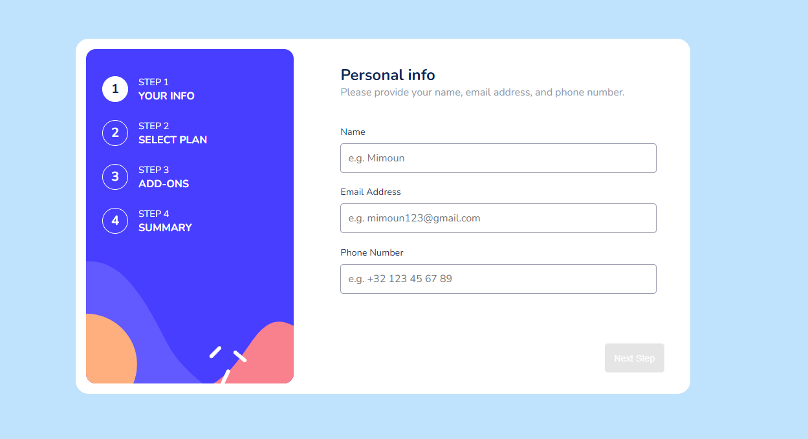

# Multi-Step Subscription Form

A dynamic subscription form built with React, showcasing modern front-end development practices and clean UI design. This project is part of my self-taught journey to become a front-end engineer.

## 🔴 Live Demo

[Click here to experience the live demo](https://multi-step-form-b0qkneyze-1dh2bes-projects.vercel.app/)

## 📸 Preview



## 🚀 Features

- Multi-step form with seamless navigation
- Dynamic pricing and plan selection
- Real-time form validation
- Responsive design
- Interactive add-ons selection
- Billing cycle toggle (Monthly/Yearly)
- Order summary and confirmation

## 🛠️ Built With

- React.js
- React Router
- Context API for state management
- CSS Modules
- React Hooks

## 💻 Local Development

```bash
# Clone repository
git clone git@github.com:1Dh2Be/multi_step_form.git

# Install dependencies
npm install

# Run development server
npm start
```

## 🌟 Learning Highlights

This project demonstrates my proficiency in:
- Building complex forms with React
- Managing application state
- Implementing responsive design
- Writing clean, maintainable code
- Using modern React patterns and hooks
- Implementing local storage for data persistence
- State management with Context API

## 🤝 Contributing

Feel free to fork this project and submit pull requests. You can also open issues for any bugs or improvements.

## 📫 Contact

My LinkedIn: [Mimoun Atmani](https://www.linkedin.com/in/mimoun-atmani)


## 🙏 Acknowledgments

- Design inspiration from Frontend Mentor
- Part of my self-taught journey in web development

---
⭐️ From 1Dh2Be
